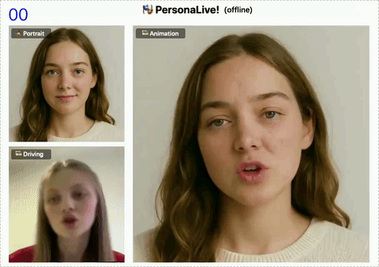
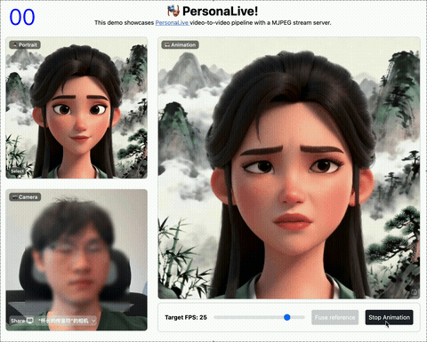
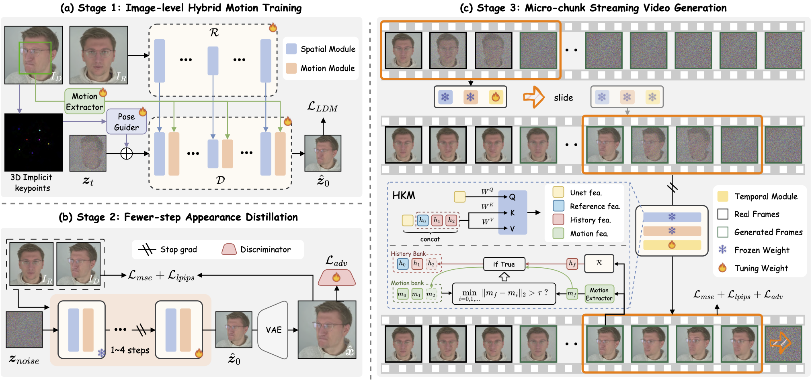

<div align="center">


<h2>Expressive Portrait Image Animation for Live Streaming</h2>

#### [Zhiyuan Li<sup>1,2,3</sup>](https://huai-chang.github.io/) · [Chi-Man Pun<sup>1</sup>](https://cmpun.github.io/) 📪 · [Chen Fang<sup>2</sup>](http://fangchen.org/) · [Jue Wang<sup>2</sup>](https://scholar.google.com/citations?user=Bt4uDWMAAAAJ&hl=en) · [Xiaodong Cun<sup>3</sup>](https://vinthony.github.io/academic/) 📪
<sup>1</sup> University of Macau  &nbsp;&nbsp; <sup>2</sup> [Dzine.ai](https://www.dzine.ai/)  &nbsp;&nbsp; <sup>3</sup> [GVC Lab, Great Bay University](https://gvclab.github.io/)

<a href='https://arxiv.org/abs/2512.11253'></a> <a href='https://huggingface.co/huaichang/PersonaLive'></a> [](https://github.com/GVCLab/PersonaLive)


 &nbsp;&nbsp; 
</div>

## 📣 Updates
- **[2025.12.15]** 🔥 Release `paper`!
- **[2025.12.12]** 🔥 Release `inference code`, `config` and `pretrained weights`!

## ⚙️ Framework



We present PersonaLive, a `real-time` and `streamable` diffusion framework capable of generating `infinite-length` portrait animations on a single `12GB GPU`.


## 🚀 Getting Started
### 🛠 Installation
```
# clone this repo
git clone https://github.com/GVCLab/PersonaLive
cd PersonaLive

# Create conda environment
conda create -n personalive python=3.10
conda activate personalive

# Install packages with pip
pip install -r requirements.txt
```

### ⏬ Download weights
1. Download pre-trained weight of based models and other components ([sd-image-variations-diffusers](https://huggingface.co/lambdalabs/sd-image-variations-diffusers) and [sd-vae-ft-mse](https://huggingface.co/stabilityai/sd-vae-ft-mse)), you can run the following command to download weights automatically:
    ```
    python tools/download_weights.py
    ```

2. Download pre-trained weights into the `./pretrained_weights` folder.
    
    <a href='https://drive.google.com/drive/folders/1GOhDBKIeowkMpBnKhGB8jgEhJt_--vbT?usp=drive_link'></a> <a href='https://pan.baidu.com/s/1DCv4NvUy_z7Gj2xCGqRMkQ?pwd=gj64'></a> <a href='https://www.alipan.com/s/jyJ9JBqS6Ty'></a> <a href='https://huggingface.co/huaichang/PersonaLive'></a>

Finally, these weights should be orgnized as follows:
```
pretrained_weights
├── onnx
│   ├── unet_opt
│   │   ├── unet_opt.onnx
│   │   └── unet_opt.onnx.data
│   └── unet
├── personalive
│   ├── denoising_unet.pth
│   ├── motion_encoder.pth
│   ├── motion_extractor.pth
│   ├── pose_guider.pth
│   ├── reference_unet.pth
│   └── temporal_module.pth
├── sd-vae-ft-mse
│   ├── diffusion_pytorch_model.bin
│   └── config.json
└── sd-image-variations-diffusers
│   ├── image_encoder
│   │   ├── pytorch_model.bin
│   │   └── config.json
│   ├── unet
│   │   ├── diffusion_pytorch_model.bin
│   │   └── config.json
│   └── model_index.json
└── tensorrt
    └── unet_work.engine
```

### 🎞️ Offline Inference
```
python inference_offline.py
```
### 📸 Online Inference
#### 📦 Setup Web UI

**For Linux/macOS:**
```bash
# install Node.js 18+
curl -o- https://raw.githubusercontent.com/nvm-sh/nvm/v0.39.1/install.sh | bash
nvm install 18

cd webcam
bash start.sh
```

**For Windows:**

1.  **Install Dependencies:**
    -   Install Python 3.10 and PyTorch 2.1.0+cu121 by following the official instructions.
    -   Install Node.js 18+ from the [official website](https://nodejs.org/) and ensure `npm` is in your system's PATH.

2.  **Set Up the Backend:**
    -   Open a terminal and navigate to the project's root directory.
    -   Run `pip install -r requirements.txt` to install the required Python packages.

3.  **Launch the Application:**
    -   In the same terminal, navigate to the `webcam` directory (`cd webcam`).
    -   Run `call start.bat`. This will build the frontend and start the backend server.
    -   Open your browser and go to `http://localhost:7860`.

#### 🏎️ Acceleration (Optional)
Converting the model to TensorRT can significantly speed up inference (~ 2x ⚡️). Building the engine may take about `20 minutes` depending on your device. Note that TensorRT optimizations may lead to slight variations or a small drop in output quality.

**Note for Windows Users:**
- The `pycuda` and `tensorrt` libraries can be challenging to install on Windows. Please refer to their official documentation for detailed installation instructions.
- Ensure you have a compatible NVIDIA driver and CUDA Toolkit installed before attempting to install these packages.

```
python torch2trt.py
```


## 📋 Citation
If you find PersonaLive useful for your research, welcome to 🌟 this repo and cite our work using the following BibTeX:
```bibtex
@article{li2025personalive,
  title={PersonaLive! Expressive Portrait Image Animation for Live Streaming},
  author={Li, Zhiyuan and Pun, Chi-Man and Fang, Chen and Wang, Jue and Cun, Xiaodong},
  journal={arXiv preprint arXiv:2512.11253},
  year={2025}
}
```

## ❤️ Acknowledgement
This code is mainly built upon [Moore-AnimateAnyone](https://github.com/MooreThreads/Moore-AnimateAnyone), [X-NeMo](https://byteaigc.github.io/X-Portrait2/), [StreamDiffusion](https://github.com/cumulo-autumn/StreamDiffusion), [RAIN](https://pscgylotti.github.io/pages/RAIN/) and [LivePortrait](https://github.com/KlingTeam/LivePortrait), thanks to their invaluable contributions.
